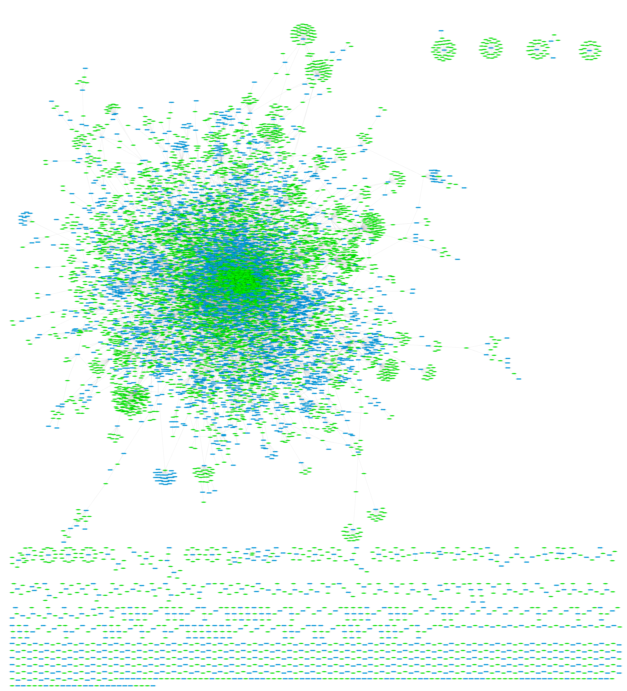
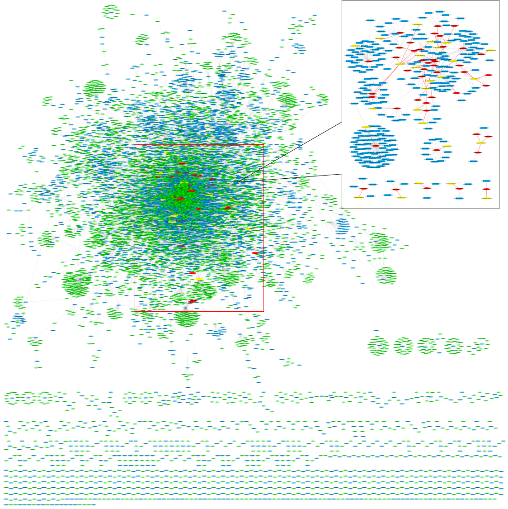

# Scalable and Accurate Drug-target Prediction Based on Heterogeneous Biolinked-network Mining

<table border='1' align="center">
<tr><td>Training Bipartite Network</td><td>Predicted Bipartite Network</td></tr>
<tr>
<td></td>
<td></td>
</tr>
</tabe>

# Objective:   
We propose a similarity-based drug-target prediction method that enhances existing association discovery methods by using a topology-based similarity measure. 

# Methods:
* 1. NetWork: MultiPartite Network
	* Statistic of network
	
|Name|Statistics|
|-----------------------------|-----------------------------|
|Drug|6,990|
|Target|4,267|
|Disease|3,260|
|Sider effect|1,695|
|Pathway|379|
|Haplotype|587
|Variant location|2,941|
|Vertices in total|20,119
|Drug-target associations|20,583|
|Disease-target associations|13,205|
|Drug-disease associations|7,232|
|Drug-drug associations|38,140|
|Disease-disease associations|100|
|Target-target associations|388|
|Disease-haplotype associations|3,632|
|Drug-haplotype associations|3,112|
|Disease-variant location associations|12,277|
|Drug-variant location associations|6,868|
|Disease-pathway associations|5,057|
|Drug-pathway associations|3,889|
|Target-pathway associations|10,349|
|Drug-side effect associations|69,464|
|Edges in total|194,296|
	
* 2. Embedding method: Node2vec
* 3. Prediction method: BSI+Classification

# Usage   
* Embedding
	* (a) node2vec
		* 1. covert input data to node2vec format data: PythonDataPreparement.java
		* 2. generate Python script for node2vec embedding: PythonScripter.java
		* 3. node2vec embedding: https://github.com/aditya-grover/node2vec
		* 4. post-process for the embedding model: EmbeddingPostProcessing.java
	* (b) deepwalk
		* 1.deepwalk-based embedding: DeepWalkMethod().training(parameters)
* Prediction   
  

# Contact
For help or questions of using the application, please contact zongnansu1982@gmail.com
